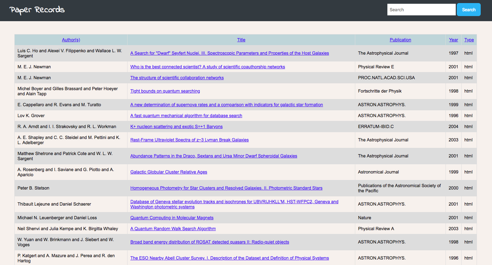
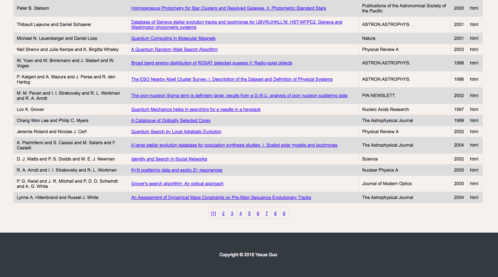
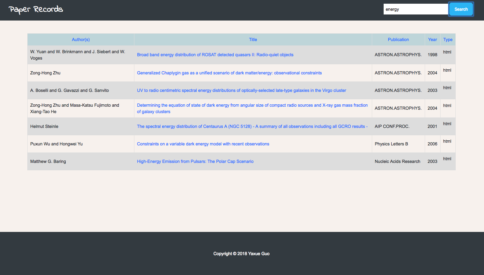

# Record Display Website

This record display website uses PHP to read records from a MySQL database and then display them to the webpage by outputting HTML. The title in the table for each record is a hyperlink to the URL for that record so that if you click on the title in a web browser, it should tale you to the page specified by the URL.

## Technology Stack

PHP, MySQL, HTML, CSS.

## Function Explaination

  * 25 records displayed per page by default. 
  
  
  
  
  * By default, the records are displayed in order by item number. However, User can click any other heading to re-sort the records by this field using the *GET* method.
  
  ```
    <tr>
      <td class="heading"><a href="browse.php?sortby=authors">Author(s)</a></td>
      <td class="heading"><a href="browse.php?sortby=title">Title</a></td>
      <td class="heading"><a href="browse.php?sortby=publication">Publication</a></td>
      <td class="heading"><a href="browse.php?sortby=year">Year</a></td>
      <td class="heading"><a href="browse.php?sortby=type">Type</a></td>
    </tr>
    
    <?php
      $sortby = $_GET['sortby'];
      
       #Use switch in case that a user input illegal url mannually.
    if (!isset($sortby)) {
        $sortby = "itemnum";
    } else {
        switch ($sortby) {
            case "authors":
                $sortby = "authors";
                break;
            case "title":
                $sortby = "title";
                break;
            case "publication":
                $sortby = "publication";
                break;
            case "year":
                $sortby = "year";
                break;
            case "type":
                $sortby = "type";
                break;
            default:
                $sortby = "itemnum";
        }
    }
  ```
  
  * Full-text search function supported.
  
  
  
## Author

* Yaxue Guo independently developed this site.